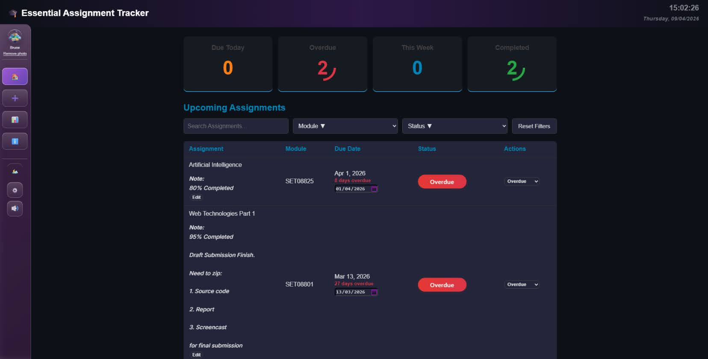

# 🎓 Essential Assignment Tracker V 2.0.0

A lightweight client-side web application designed to help university students stay organised and manage coursework deadlines effectively. The application focuses on simplicity, usability, and real-time feedback without the complexity of larger platforms.

---
## 🔗 Live Demo
[View the application](https://elgold3n.github.io/Essential-Assignment-Tracker-V-2.0.0/ )

---

## 🧱 Technologies Used

---

## 📄 Legal

 

---

## 📚 About This Project

This is a personal Essential Assignment Tracker developed to support students in managing academic tasks more efficiently. It provides a clear and distraction-free environment for tracking assignments and deadlines.

---

## ✨ Core Features

- 📅 Dashboard overview of upcoming assignments and deadlines  
- ➕ Assignment creation with name, due date, priority, module, status, and notes  
- 🎯 Colour-coded urgency badges (**yellow** for **Due Soon**, **red** for **Overdue**)  
- 🧠 Smart module support:
  - Module suggestions during input  
  - Auto-learning module filters on the dashboard  
  - 🔎 Filtering and sorting options for assignment views
- 💾 Backup/export of assignment data as JSON  
- 🔐 Local browser storage for assignments and preferences  

- ⚡ Fully client-side and lightweight (no login, no ads, no external dependencies)  

---

## 🚀 Additional Features

### Current Enhancements

- 🔁 One-click **Reset Filters** option
-  🔊 Optional button sound feedback with toggle control
- 👤 Persistent user profile with image upload/remove functionality
- ⏰ Live date and time display in the header
- 🎧 Combined visual and audio action feedback  
- 🎨 Minimalist, distraction-free interface focused on usability  

---

## 🎯 Main Goals

- 👁️ Provide a clear overview of what needs attention today or this week  
- 💾 Enable backup and export of assignment data as JSON files  
- 🔐 Store all data and preferences locally in the browser  
- 🔇 Allow users to control sound feedback for a personalised experience  

---

## ⚙️ How It Works

The application runs entirely on the client side using JavaScript. All data is stored locally in the browser, ensuring privacy and eliminating the need for a backend system.

Dynamic event handling updates the interface in real time without requiring page refreshes.

---

## 🖥️ Interface Overview

The interface is designed to be clean and intuitive, featuring:

- A central dashboard for assignment management  
- Filtering and sorting options  
- Real-time visual and audio feedback  
- Minimalist layout for improved focus and usability

---

  

 

---

## 🏃‍➡️ How to Run

1. Download or clone the repository  
2. Open the project folder  
3. Run `index.html` in a web browser  

⛔ No installation or setup is required.

🎧 Sound effect files are stored in the `FX/` folder.

---

## 🔊 Unique Feature

A distinctive feature of this tracker is the integration of audio feedback alongside visual notifications. This enhances user interaction by providing immediate confirmation of actions.

---

## 🚧 Future Improvements

- 🔔 Assignment reminder notifications before deadlines  
- 📊 Progress analytics (weekly trends and workload tracking)  
- 📱 Mobile-first responsive layout optimisation  
- 🎉 Celebration mode when all assignments are completed  
- 🗑️ Bulk deletion functionality  

---
## 📖 Inspiration

This project was inspired by personal handwritten assignment notes and early design sketches, which influenced the structure and usability of the interface.

---
## 📄 Legal

This project is protected under a proprietary license and includes defined terms of use.

- 📘 [Terms of Use](./TERMS_OF_USE.md)
- 🔒 [License](./LICENSE)

> 🎓 This project is for learning and usage only. Do not submit it as your own academic work.
---

## 🎓 Project Information

**Created by:** Cameron Bruce  
**Module:** SET08801 – Web Technologies  
**Project:** Essential Assignment Tracker  
**Date:** May 2026  
**Version:** 2.0.0  
